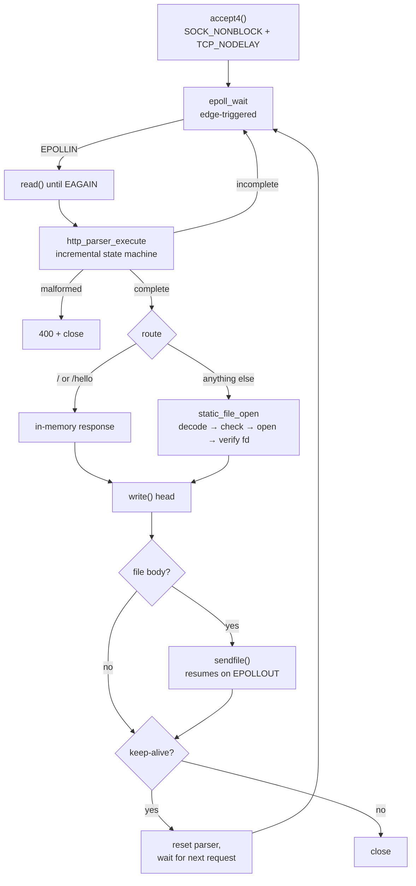

# http-server

An HTTP/1.1 server written from scratch in C11 on raw Linux syscalls. No libevent, no libuv, no dependencies beyond libc. Built in seven layers, each one solving a specific problem: blocking sockets, then epoll, then a real parser, then keep-alive, then `sendfile()`, then multicore, then a benchmark that found a 40ms bug.


- **C10k by design.** Edge-triggered `epoll` with one non-blocking socket per connection and no thread per client. 200 concurrent connections are served at 79,371 req/s on 8 cores.
- **Security defended deliberately, not incidentally.** Path traversal, request smuggling, Slowloris, symlink escapes and SIGPIPE kills are each closed off explicitly, with the reasoning recorded in the code.
- **Multicore without locks.** One event loop per core, each with its own `SO_REUSEPORT` listen socket, so the kernel does the load balancing and no mutable state is shared between threads.
- **A real performance bug, found by measuring.** The benchmark exposed a Nagle/delayed-ACK stall that pinned every static file response at ~44ms. One socket option removed it: **268x throughput** on the small-file scenario.

---

## Performance finding: the 44ms that was not contention

The first benchmark run produced a number that made no sense:

| scenario | route | req/s | avg latency |
|---|---|---:|---:|
| `inline` | `/` — response built in memory, one `write()` | 4,633 | 1.05ms |
| `small-file` | `/hello.txt` — 271 bytes via `sendfile()` | **22** | **44.64ms** |

Same server, same process, same connection count. A 42x latency gap between two routes that differ only in where the body comes from.

The tell was that the 44ms **did not move**: not with 1 connection, not with 200, not between runs. Contention grows with load and shrinks when idle. A constant is a timer — and ~40ms is the Linux delayed-ACK timer.

**What was happening.** A file response leaves in two pieces: `write()` puts the header out, then `sendfile()` sends the body. The header is a small segment, so Nagle's algorithm (RFC 896) refuses to send the next small segment until the first is acknowledged — that is exactly its job, keeping a stream of tiny writes from becoming a stream of tiny packets. Meanwhile the client has just sent its request and has nothing to say, so delayed ACK (RFC 1122 §4.2.3.2) holds the acknowledgement back up to 40ms hoping to piggyback it on data of its own. Neither side is wrong, neither moves first, and every response waits out the timer. The in-memory routes never showed it because their entire response is a single `write()`.

**The fix.** `TCP_NODELAY` on every accepted socket, set in `accept_new_connections()` alongside the existing non-blocking flag. Nagle's heuristic exists because the application never told the kernel where its messages end; in a request/response protocol that guess is simply wrong, since the server writes one complete message and then stops to wait for the peer. There is never a following small write to coalesce with, so holding the last segment can only add latency. This is why nginx, Apache and Go's `net/http` all set it unconditionally.

### small-file (`/hello.txt`), before → after

| connections | req/s before | req/s after | change | avg before | avg after | p99 before | p99 after |
|---:|---:|---:|---:|---:|---:|---:|---:|
| 1 | 22 | **5,894** | **268x** | 44.64ms | **0.24ms** | 48.12ms | 2.05ms |
| 10 | 179 | **20,933** | 117x | 44.62ms | 1.44ms | 48.24ms | 22.41ms |
| 50 | 1,066 | **66,413** | 62x | 44.89ms | 1.16ms | 55.99ms | 13.15ms |
| 200 | 4,457 | **69,454** | 15.6x | 44.63ms | 2.94ms | 56.11ms | 15.57ms |

The floor is gone at every concurrency level, which is the point: it was never contention, so no amount of load could amortize it away. Afterwards the file path sits right next to the in-memory control, as it should — the two differ only in where the bytes come from:

| connections | `inline` avg | `small-file` avg (after) |
|---:|---:|---:|
| 1 | 0.15ms | 0.24ms |
| 50 | 1.17ms | 1.16ms |

The 8MiB scenario was unaffected, as expected: Nagle never holds back a full-size segment. The two saved runs disagree there (781 vs 388 req/s at c10), so both binaries were re-run alternately, three rounds each — 797/806/850 with `TCP_NODELAY` against 807/802/809 without. Same population; that row is loopback noise, not an effect of the change.

Raw output for both runs, and the full write-up, are in [`benchmarks/results/`](benchmarks/results/) — `20260804-153317/` (before), `20260804-154353/` (after), and [`COMPARISON.md`](benchmarks/results/COMPARISON.md).

---

## Quickstart

Requires Linux, GCC and Make. One minute, start to finish:

```bash
git clone <repository-url> && cd http-server
make
make run
```

The server binds `0.0.0.0:8080` and serves `public/` from the working directory:

```bash
curl -i http://localhost:8080/            # built-in route, in-memory response
curl -i http://localhost:8080/hello.txt   # static file via sendfile()
curl -i http://localhost:8080/index.html
curl -i http://localhost:8080/nope        # 404
```

A response looks like this — `X-Worker` names the thread that served it, which is how the thread pool is verified from outside the process:

```http
HTTP/1.1 200 OK
Content-Type: text/plain; charset=utf-8
Content-Length: 271
X-Worker: 3
Connection: keep-alive
```

### Configuration

Everything is environment driven, no config file:

| variable | default | purpose |
|---|---|---|
| `HTTP_SERVER_WORKERS` | online CPU count | worker threads, 1–64 |
| `HTTP_SERVER_IDLE_TIMEOUT_SECONDS` | `30` | idle connection reaping, 1–3600 |
| `HTTP_SERVER_PUBLIC_ROOT` | `public` | document root |

Invalid values are rejected with a message and the default is used, rather than being silently accepted.

---

## Architecture

Seven layers, each a commit, each solving the problem the previous one exposed.

| # | layer | what it added |
|---|---|---|
| 1 | Blocking TCP | `socket`/`bind`/`listen`/`accept` with a hardcoded 200 response. One client at a time. |
| 2 | Non-blocking I/O | Edge-triggered `epoll`, every fd `O_NONBLOCK`. Read loops must drain to `EAGAIN` or events are lost forever. |
| 3 | HTTP parser | An incremental state machine that survives being fed one byte at a time, with strict CRLF framing and bounded field sizes. |
| 4 | Keep-alive | Persistent connections, pipelining, `EPOLLOUT` backpressure for slow readers, and an idle timeout to close Slowloris. |
| 5 | Static files | `sendfile()` straight from the page cache to the socket, with path traversal and symlink-escape defenses. |
| 6 | Thread pool | One event loop per core, each with its own `SO_REUSEPORT` listen socket. No shared mutable state, so no locks. |
| 7 | Benchmark | A release build without sanitizers, wrk across four concurrency levels — which found the Nagle stall above. |

### Request flow



Four fds live in each worker's epoll set, distinguished by the tag stashed in `epoll_event.data.ptr`: the listen socket (`NULL`), a `timerfd` driving the idle sweep, a shared shutdown `eventfd`, and one `connection_t *` per client — which is why no fd-to-state lookup table is needed at all.

### Concurrency model

```
                    port 8080
                        |
        +-------+-------+-------+-------+
        |       |       |       |       |     kernel hashes the 4-tuple
     listen  listen  listen  listen  ...      (SO_REUSEPORT)
        |       |       |       |       |
     epoll   epoll   epoll   epoll   ...      one per worker thread
        |       |       |       |       |
     conns   conns   conns   conns   ...      never shared, never locked
```

A shared listen socket would put N threads on one accept queue — a thundering herd, or one acceptor thread behind a mutex that becomes the ceiling on connection rate. `SO_REUSEPORT` removes the contention instead of managing it: each worker has a private accept queue, and because a connection's 4-tuple always hashes the same way, it stays with the thread that accepted it for its whole life. That invariant is what lets per-connection state be lock-free.

The trade-off is honest to state: balancing is per connection and hash-based, not per load, so a worker that draws a long-lived heavy connection keeps it and the kernel will not rebalance.

---

## Security

Each defense is implemented deliberately, with the reasoning recorded next to the code.

| threat | defense |
|---|---|
| **Path traversal** | Percent-decode first, *then* reject — any `..` segment, any NUL byte, any absolute path is a 400, because checking before decoding is how `%2e%2e` gets through. |
| **Symlink escape (TOCTOU-safe)** | After `open()`, the real path is read back from `/proc/self/fd/N` and re-checked against the root. Validating the path string instead leaves a window to swap a directory for a symlink between check and open; here the fd is already pinned to an inode. |
| **Request smuggling** | Strict CRLF only. A bare LF terminating a request line or header is rejected outright — RFC 7230 §3.5 permits tolerating it, and that tolerance is where smuggling ambiguity lives. |
| **Slowloris** | Every connection carries a last-activity timestamp; a `timerfd` sweeps every 5s and closes anything idle past the timeout, whether stalled mid-request or between keep-alive requests. |
| **SIGPIPE process kill** | Ignored process-wide, so a client vanishing mid-download turns into an `EPIPE` the write path already handles. `sendfile()` has no `MSG_NOSIGNAL`, so per-call opt-out is not available. |
| **Resource exhaustion** | Bounded everywhere by construction: 2048-byte paths, 8192-byte header lines, 64 headers max, 4096-byte read chunks. |
| **Information disclosure** | Every filesystem failure collapses to 404, including `EACCES` — distinguishing "exists but forbidden" from "absent" hands out a map of the filesystem one request at a time. |
| **Directory ambiguity** | No directory listings, no implicit index; a trailing slash is a 404 rather than quietly serving the file without it, which would give one resource two URLs. |

Verified live over raw sockets (curl normalizes `..` client-side, so it cannot test this):

```
/../etc/passwd             -> 400    /%2e%2e/%2e%2e/etc/passwd -> 400
/..%2fetc/passwd           -> 400    /hello.txt%00.png         -> 400
/assets/../hello.txt       -> 400    /assets/style.css         -> 200
```

---

## Benchmarks

### vs nginx

Same machine, same `public/` directory, same wrk invocation, servers alternated per measurement to control for drift. nginx 1.28.3, 8 workers, `sendfile on`, serving the identical files on port 8081.

**small-file — `/hello.txt`, 271 bytes**

| connections | this server | nginx | ratio |
|---:|---:|---:|---:|
| 1 | 4,801 req/s | **5,148 req/s** | 0.93x |
| 10 | **26,035 req/s** | 15,331 req/s | 1.70x |
| 50 | **70,273 req/s** | 60,026 req/s | 1.17x |
| 200 | **79,371 req/s** | 47,613 req/s | 1.67x |

**large-file — `/benchmark-large.bin`, 8MiB**

| connections | this server | nginx | ratio |
|---:|---:|---:|---:|
| 1 | 207 req/s | **254 req/s** | 0.81x |
| 10 | 907 req/s | **972 req/s** | 0.93x |
| 50 | **943 req/s** | 902 req/s | 1.05x |
| 200 | 685 req/s | **741 req/s** | 0.93x |

**Read these honestly.** nginx is doing strictly more work per request in this configuration: it writes an access log line to disk for every request (this server writes none), runs `try_files` with the extra `stat()` that implies, and carries a full HTTP feature set — virtual hosts, rewrites, compression, proxying, TLS — that this server does not implement at all. It also wins single-connection latency on both scenarios by a clear margin (220µs vs 417µs on small files), and it wins large-file throughput at most concurrency levels.

The claim worth making is narrower than the table looks: a 2,359-line server that serves three static files can reach the same order of magnitude as a production server on the workload it was designed for, and beat it on concurrent small files where nginx's per-request logging costs the most. That validates the architecture — epoll, `sendfile`, `SO_REUSEPORT` — not the feature set.

### Methodology

- **Release build**, `-O2`, no sanitizers (`make release` → `http-server-release`). AddressSanitizer alone costs roughly 2x CPU and 3x RSS and replaces `malloc` with a redzone/quarantine allocator, which lands squarely on the per-connection allocation path; measuring it would mostly measure GCC.
- **wrk**, 10s per run, four concurrency levels (1, 10, 50, 200), one unrecorded warmup per scenario so page-cache filling is not charged to whichever scenario runs first.
- **Two response sizes**, 271 bytes and 8MiB, plus an in-memory route as the control that isolates the `sendfile()` path from everything else.
- **wrk threads capped at half the cores**, so the load generator and the server are not fighting over all eight.
- **These are loopback numbers**, with the load generator on the same 8 CPUs as the server. There is no network, no RTT, no packet loss. Treat the columns as relative to each other, not as absolute capacity.

Reproduce with `make benchmark`; results land in `benchmarks/results/<timestamp>/` with raw wrk output and an `environment.txt` recording kernel, CPU count, compiler, flags and git commit.

---

## Tests

249 checks across five suites, all passing:

| suite | kind | checks | what it covers |
|---|---|---:|---|
| `tests/test_http_parser.c` | unit | 98 | Byte-at-a-time feeding, malformed input, CRLF strictness, keep-alive negotiation, field limits |
| `tests/test_static_files.c` | unit | 54 | Path decoding and traversal rejection, MIME mapping, root containment |
| `tests/test_static_files.py` | integration | 49 | `sendfile()` backpressure with a 4MiB body, symlink escapes, clients vanishing mid-download |
| `tests/test_keepalive.py` | integration | 26 | Persistent connections, pipelining, HTTP/1.0 vs 1.1 defaults, idle timeout |
| `tests/test_thread_pool.py` | integration | 22 | Concurrent connections across workers, thread count, connection-to-worker affinity, clean shutdown |

```bash
make test          # unit suites only, no server process
make test-all      # unit + all three integration suites
```

Unit suites link the module sources directly. Integration suites drive the real compiled binary over real TCP sockets, because raw-socket timing, partial writes and multi-request connections are not things a unit test can honestly fake.

Everything is built with **AddressSanitizer and UndefinedBehaviorSanitizer** at `-O1` — `-O1` rather than `-O0` because `-Wmaybe-uninitialized`, `-Wformat-truncation` and the `-Wstringop-*` family depend on optimizer data-flow analysis and are silently disabled without it. The graceful-shutdown test asserts a process exit code of 0, which means LeakSanitizer's exit code 23 makes any leak on the shutdown path a test failure rather than a footnote.

The build is warning-free under `-Wall -Wextra -Wpedantic` in both debug and release.

Note that ASan does not detect data races — that is ThreadSanitizer's job, and the two cannot be enabled together. Layer 6 answers that by construction rather than by tooling: workers share no mutable state, so there is nothing for a race detector to find.

---

## Known limitations

Scope boundaries, stated rather than hidden:

- **`HEAD` returns 405.** Only `GET` is implemented, and `HEAD` is rejected like any other method — on static files and built-in routes alike, so the behavior is at least consistent. It is still a deviation from RFC 7231 §4.3.2, which requires a server supporting `GET` on a resource to support `HEAD` on it too. Implementing it correctly means sending the identical headers with the body suppressed, including the `Content-Length` the body *would* have had.
- **No chunked transfer encoding**, request or response. Every response carries a `Content-Length`.
- **No request bodies.** `POST`/`PUT` are recognized as methods and answered 405 on resources that exist (404 on those that do not), but no `Content-Length` body is ever consumed, so a body would be misread as the start of the next request on a keep-alive connection.
- **No TLS, no virtual hosts, no compression, no proxying, no directory listings.**
- **No fd-exhaustion backoff.** On `EMFILE` the accept loop logs and returns; under edge-triggered epoll that can strand queued connections until the next new arrival.
- **Shutdown drops in-flight responses.** Workers close their connections rather than draining them, so a client mid-download sees the connection close. Draining would need a deadline for peers that stop reading.
- **`_SC_NPROCESSORS_ONLN` is not container-aware.** It counts system CPUs, not the cgroup quota or affinity mask; `HTTP_SERVER_WORKERS` is the escape hatch.

---

## Requirements

| | |
|---|---|
| **OS** | Linux. `epoll`, `sendfile`, `accept4`, `timerfd`, `eventfd`, and `SO_REUSEPORT` (kernel ≥ 3.9) are all Linux-specific; there is no portability layer. |
| **Compiler** | GCC with C11 support. Built and tested with GCC 15.2. |
| **Build** | GNU Make. |
| **Tests** | Python 3 for the integration suites. |
| **Benchmarks** | `wrk` and `curl`. |

Developed on Linux 6.18 (WSL2), 8 cores.

## Layout

```
src/            server sources
  main.c          startup, signals, shutdown eventfd
  worker_pool.c   thread pool, SO_REUSEPORT listen sockets
  event_loop.c    epoll loop, connections, routing, response writing
  http_parser.c   incremental HTTP/1.1 request parser
  static_files.c  path resolution and root containment
tests/          unit (C) and integration (Python) suites
public/         document root
scripts/        benchmark.sh
benchmarks/     benchmark results, timestamped
```

## License

MIT — see [LICENSE](LICENSE).
